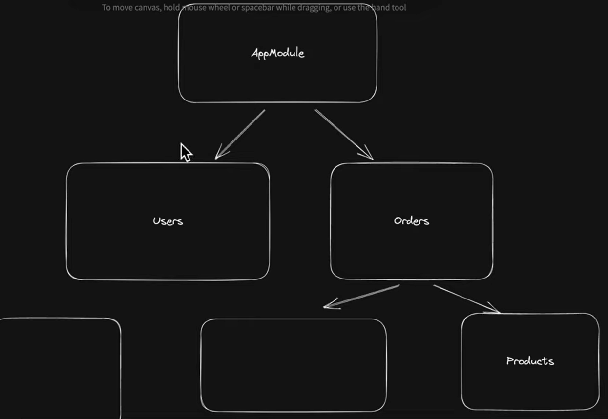
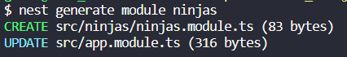

Nest lets you build apis and gives you a great architecture to work on

When we make a request, this is the path in the repository that it follows:
- requisição HTTP
- controller
- service

## Modules
We can think of the [app.module.ts](../src/app.module.ts) as the root of the application

Modules are a way to encapsulate a related set of capabilities
- Modules can depend on each other

- To create new modules, use `nest generate module <module_name>`, like follows:



Similarly:
- `nest g controller <controller_name>` to create a ninjas controller
- `nest g service <service_name>` to create a ninjas provider

But you can do the three steps in just one:
`nest g resource <resource_name>`

## Controller
// @Decorator

Looking at the [ninjas.controller.ts](../src/ninjas/ninjas.controller.ts) file:
- `@Controller('ninjas')` tells that everything inside the controller will have the `'ninjas'` prefix
- The decorators tells the controller what req type it is (like `@Get`, `@Post`)
- To use a req parameter (like an id) we use the decorator param: `@Param('id')`
    - Behind the scenes, nest is parsing the url and auto injects it into the method 
- To get a query from the url (like `/ninjas?fast`), we use the `@Query` decorator
- DTO = Data Transfer Object

## Providers
Providers have a injectable decorator. These injectable services refer to classes or providers that can be injected into other classes or components within the application. These services encapsulate specific functionality, making the code modular and easier to manage.

## Validators
Validation pipes can be used to transform data and validate data. They run before a service is called.

Example: in the code below, we're using a validation pipe to validate the @Body of the post request
```javascript
  @Post()
  createNinja(@Body(new ValidationPipe()) createNinjaDto: CreateNinjaDto) {
    return this.ninjasService.createNinja(createNinjaDto);
  }
```
And inside our post dto, we specify our validation prerequisites with validation decorators::
```javascript
export class CreateNinjaDto {
  @MinLength(3)
  name: string;

  weapon: 'stars' | 'kindness';
}
```
[Class Validator Documentation](https://github.com/typestack/class-validator)